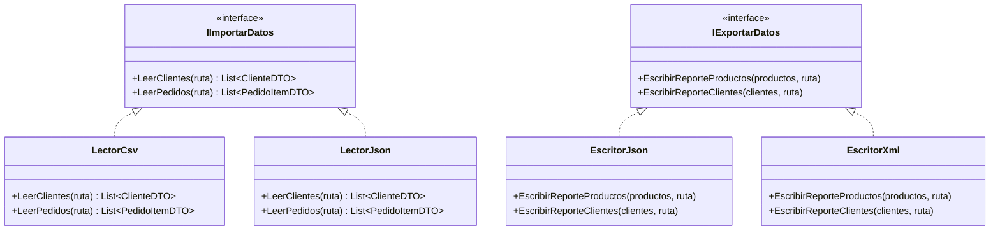
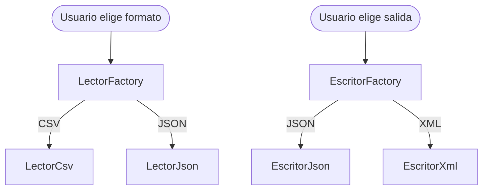
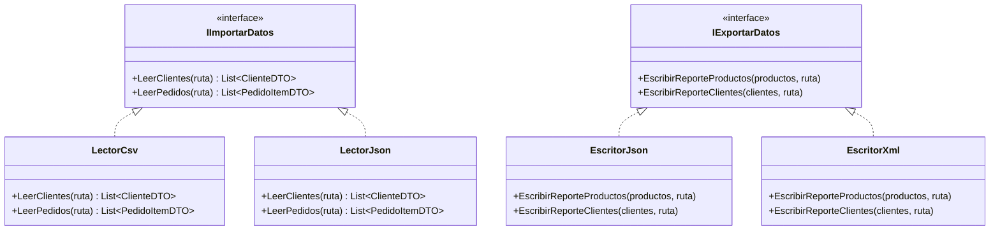

# Arquitectura, Patrones de Diseño y Requerimientos del Sistema

Este documento describe la arquitectura lógica del sistema, los patrones de diseño aplicados, las reglas de negocio extraídas del enunciado y el estado de implementación actual de cada componente.

---

## 1. Declaración de Uso de Inteligencia Artificial

Como equipo, declaramos de forma transparente y honesta que hemos utilizado herramientas de Inteligencia Artificial durante la concepción de este proyecto para los siguientes fines:
- **Comprensión de conceptos**: Explicación y comparación práctica de patrones de diseño (Factory y Strategy) y convenciones de C#.
- **Organización de la información**: Formateo y estructuración de nuestras notas en documentación coherente.

Las **decisiones esenciales de negocio, arquitectura y flujo del software** fueron analizadas y aprobadas por los integrantes del equipo, alineadas con lo visto en clase.

---

## 2. Requerimientos del Sistema

El sistema es un **Pipeline de Análisis de Clientes y Compras** ejecutado como aplicación de consola en C#.

### A. Interfaz de Usuario (Consola)

El programa solicita por consola:
1. Ruta del archivo de clientes.
2. Ruta del archivo de compras (pedidos).
3. Formato de cada archivo (`CSV` o `JSON`, de forma independiente).
4. Formato del reporte de salida (`JSON` o `XML`).

### B. Estructura de los Archivos de Entrada

#### Archivo de clientes:
| Columna | Descripción | Obligatorio |
| :--- | :--- | :--- |
| `id_cliente` | Identificador único | Sí |
| `nombre` | Nombre completo | Sí |
| `email` | Correo electrónico válido (campo de unión con pedidos) | Sí |
| `ciudad` | Ciudad de residencia | No (puede estar vacío) |
| `tipo_cliente` | `"natural"` o `"empresarial"` | Sí |

#### Archivo de pedidos:
Un mismo `id_pedido` aparece en **varias filas**, una por cada ítem del pedido.

| Columna | Descripción | Tipo esperado |
| :--- | :--- | :--- |
| `id_pedido` | Identificador del pedido | `string` |
| `email_cliente` | Email del cliente asociado | `string` |
| `fecha` | Fecha de compra | `string` (se parsea con `TryParseExact`) |
| `tipo_pedido` | `"nacional"` o `"internacional"` | `string` |
| `id_producto` | ID del artículo | `string` |
| `nombre_producto` | Nombre del artículo | `string` |
| `categoria_producto` | Categoría del artículo | `string` |
| `cantidad` | Unidades compradas | `int` (mayor a 0) |
| `precio_unitario` | Precio pactado | `decimal` (mayor a 0) |

### C. Reglas de Negocio Clave

- **Cliente frecuente**:
  - *Natural*: más de **5 compras** realizadas.
  - *Empresarial*: total acumulado superior a **$50.000.000 COP**.
- **Impuestos por tipo de pedido**:
  - *Nacional*: **19%** sobre el subtotal.
  - *Internacional*: **30%** sobre el subtotal.
- **Pedidos huérfanos**: si un pedido referencia un email de cliente que no existe en el archivo de clientes, el pedido se almacena en una lista separada y **no detiene el procesamiento**.
- **Datos sucios**: el sistema tolera filas nulas, formatos inválidos y duplicados sin lanzar excepciones fatales.

### D. Reportes de Salida

Se generan **dos archivos** en el formato elegido por el usuario (JSON o XML):

1. **Reporte de Productos**: datos de cada producto + total de unidades vendidas (`NumeroVentas`).
2. **Reporte de Clientes**: datos del cliente, si es frecuente, total acumulado de compras, y los detalles del **pedido más costoso** (subtotal, impuesto aplicado, total final con impuestos).

**Resumen en consola** al finalizar:
- Ventas totales del negocio.
- Cantidad de pedidos nacionales vs. internacionales.
- Cantidad de clientes naturales vs. empresariales.

---

## 3. Arquitectura de Capas

```
┌─────────────────────────────────────────────────────┐
│  Program.cs  (Punto de entrada — orquestación)      │
│  └── solicita rutas y formatos al usuario           │
│  └── usa factories para obtener lector y escritor   │
└──────────────────┬──────────────────────────────────┘
                   │
       ┌───────────▼───────────┐
       │  PipelineProcessor    │  (Capa de servicios — pendiente)
       │  Orquesta la lógica   │
       │  Lee → Valida → Mapea │
       │  → Procesa → Exporta  │
       └──┬──────────┬─────────┘
          │          │
  ┌───────▼──┐  ┌────▼──────┐
  │ Lectores │  │ Escritores│  (Capa I/O — patrón Strategy)
  │ LectorCSV│  │EscritorJSON│
  │ LectorJSON│ │EscritorXML │
  └──────────┘  └───────────┘
          │
  ┌───────▼──────────────────┐
  │  DTOs (Data Transfer Objects)  │
  │  ClienteDTO, PedidoItemDTO     │  ← Entrada: datos crudos
  │  ReporteClienteDTO             │  ← Salida: datos procesados
  │  ReporteProductoDTO            │
  │  PedidoReporteDTO              │
  └───────────────────────────┘
          │
  ┌───────▼──────────────────┐
  │  Dominio (Capa de negocio)     │
  │  Cliente / ClienteNatural      │
  │  ClienteEmpresarial            │
  │  Pedido / PedidoNacional       │
  │  PedidoInternacional           │
  │  PedidoItem / Producto         │
  └───────────────────────────┘
```

---

## 4. Capa de Dominio — Estado Actual

### Cliente (Clase Abstracta) ✅
Atributos: `ID`, `Nombre`, `Email` (con validación por regex), `Ciudad`.
Método abstracto: `EsFrecuente(int cantidadCompras, decimal totalInvertido)`.
Propiedades y métodos agregados para el reporte:
- `List<Pedido> Pedidos` — lista de pedidos válidos asociados al cliente.
- `ObtenerTotalAcumulado()` — suma `CalcularValorTotalConImpuestos()` de todos sus pedidos.
- `ObtenerPedidoMasCostoso()` — retorna el `Pedido?` con el mayor valor total con impuestos.

### ClienteNatural ✅
Hereda de `Cliente`. `EsFrecuente` retorna `true` si `cantidadCompras > 5`.

### ClienteEmpresarial ✅
Hereda de `Cliente`. `EsFrecuente` retorna `true` si `totalInvertido > 50_000_000m`.

### Pedido (Clase Abstracta) ✅
Atributos: `IDPedido`, `FechaCompra`, `EmailCliente`, `Items` (`List<PedidoItem>`).
Métodos:
- `CalcularValorSinImpuestos()` ← **público, implementado** (suma subtotales de ítems).
- `CalcularImpuestoAplicado()` ← **abstracto**.
- `CalcularValorTotalConImpuestos()` ← **abstracto**.

### PedidoNacional ✅
Impuesto: `19%`. Implementa los métodos abstractos.

### PedidoInternacional ✅
Impuesto: `30%`. Implementa los métodos abstractos.

### PedidoItem ✅
Atributos: `ProductoAsociado`, `Cantidad` (> 0), `PrecioUnitario` (> 0).
Método: `CalcularSubtotalItem()` → `Cantidad × PrecioUnitario`.

### Producto ✅
Atributos: `IDProducto`, `NombreProducto`, `Categoria`, `PrecioUnitario` (> 0), `NumeroVentas`.

---

## 4b. Capa de Servicios — PipelineProcessor ✅

`PipelineProcessor` es la clase que orquesta todo el flujo de datos. Recibe las rutas y formatos elegidos por el usuario y ejecuta los siguientes pasos en orden:

1. **Carga** — usa `LectorFactory` para obtener la estrategia de lectura y cargar los DTOs crudos.
2. **Validación de clientes** — filtra filas con ID/Nombre/Email vacíos, emails con formato inválido o duplicados. Los inválidos se registran en consola como `[ADVERTENCIA]` y el proceso continúa.
3. **Agrupación de pedidos** — agrupa las filas crudas por `IdPedido` (un pedido = N ítems) y construye instancias de `PedidoNacional` o `PedidoInternacional` con sus respectivos `PedidoItem`.
4. **Relación pedido–cliente** — vincula cada pedido al cliente por email. Si el email no existe en el mapa de clientes, el pedido se guarda en `pedidosHuerfanos` sin interrumpir el proceso.
5. **Mapeo a DTOs de reporte** — construye `ReporteProductoDTO` y `ReporteClienteDTO` a partir de las entidades de dominio ya procesadas.
6. **Exportación** — usa `EscritorFactory` para obtener la estrategia de escritura y genera los archivos de reporte.
7. **Resumen en consola** — imprime totales del negocio, conteo de pedidos por tipo y clientes por tipo.

---

## 5. Capa de DTOs — Estado Actual

### DTOs de entrada (datos crudos, todos los campos con `?`)

| Clase | Rol | Estado |
| :--- | :--- | :--- |
| `ClienteDTO` | Una fila del archivo de clientes | ✅ Completo |
| `PedidoItemDTO` | Una fila del archivo de pedidos (un ítem) | ✅ Completo |

### DTOs de reporte (datos ya validados, sin `?` salvo excepciones)

| Clase | Rol | Estado |
| :--- | :--- | :--- |
| `ReporteProductoDTO` | Un producto con su total de ventas | ✅ Completo |
| `PedidoReporteDTO` | Un pedido agrupado con ítems y totales calculados | ✅ Completo |
| `ReporteClienteDTO` | Un cliente con totales y pedido más costoso (composición con `PedidoReporteDTO`) | ✅ Completo |

---

## 6. Capa de Interfaces y Patrones de Diseño

### Patrón Strategy — Lectura y Escritura

Se usa para desacoplar el pipeline del formato físico de los archivos. El `PipelineProcessor` solo habla con las interfaces, no con las clases concretas.



#### Estado de implementación:

| Clase | Implementa | Estado |
| :--- | :--- | :--- |
| `IImportarDatos` | — | ✅ Definida |
| `IExportarDatos` | — | ✅ Definida |
| `LectorCsv` | `IImportarDatos` | ✅ Implementado |
| `LectorJson` | `IImportarDatos` | ✅ Implementado |
| `EscritorJson` | `IExportarDatos` | ✅ Implementado |
| `EscritorXml` | `IExportarDatos` | ✅ Implementado |

### Patrón Factory — Selección de Estrategia

Encapsula la instanciación de la estrategia correcta según el formato elegido por el usuario. El pipeline no necesita saber qué clase concreta instanciar.



| Clase | Método | Estado |
| :--- | :--- | :--- |
| `LectorFactory` | `ObtenerLector(string formato) → IImportarDatos` | ✅ Implementado |
| `EscritorFactory` | `ObtenerEscritor(string formato) → IExportarDatos` | ✅ Implementado |

---

## 7. Plan de Trabajo — Estado Final

| # | Tarea | Commit realizado | Estado |
| :--- | :--- | :--- | :--- |
| 1 | Interfaces `IImportarDatos` e `IExportarDatos` | `feat(interfaces): definir contratos IImportarDatos e IExportarDatos` | ✅ Hecho |
| 2 | DTOs de entrada y reporte completos | `feat(dtos): completar DTOs de entrada y reporte` | ✅ Hecho |
| 3 | `LectorCSV` implementado | `feat(lectores): implementar LectorCSV con manejo de filas inválidas` | ✅ Hecho |
| 4 | `LectorJSON` implementado | `feat(lectores): implementar LectorJson y LectorFactory` | ✅ Hecho |
| 5 | `LectorFactory` | `feat(lectores): implementar LectorJson y LectorFactory` | ✅ Hecho |
| 6 | `EscritorJSON` | `feat(escritores): implementar EscritorJson, EscritorXml y EscritorFactory` | ✅ Hecho |
| 7 | `EscritorXML` | `feat(escritores): implementar EscritorJson, EscritorXml y EscritorFactory` | ✅ Hecho |
| 8 | `EscritorFactory` | `feat(escritores): implementar EscritorJson, EscritorXml y EscritorFactory` | ✅ Hecho |
| 9 | Errores técnicos de I/O en `Program.cs` | `feat(programa): configurar CLI y captura de excepciones I/O` | ✅ Hecho |
| 10 | Mapeo DTO → Entidad de dominio (`PipelineProcessor`) | `feat(pipeline): implementar mapeo y orquestacion PipelineProcessor` | ✅ Hecho |
| 11 | Implementación de Excepciones Personalizadas | `feat: add custom exceptions for domain validation and pipeline processing` | ✅ Hecho |

---

## 8. Manejo de Errores Propio y Excepciones Personalizadas

Se diseñaron e implementaron clases de excepción específicas dentro del namespace `Proyecto_Final_POO_C_.Source.Modelo` para controlar la lógica del dominio y los errores durante el flujo del pipeline:

1. **`ClienteInvalidoException`**: Hereda de `ArgumentException`. Lanzada cuando el ID o nombre del cliente están vacíos, o cuando el email no cumple con el formato regex requerido.
2. **`ProductoInvalidoException`**: Hereda de `ArgumentException`. Lanzada cuando el precio unitario del producto es menor o igual a cero, o si se intentan registrar datos vacíos.
  ┌───────▼──┐  ┌────▼──────┐
  │ Lectores │  │ Escritores│  (Capa I/O — patrón Strategy)
  │ LectorCSV│  │EscritorJSON│
  │ LectorJSON│ │EscritorXML │
  └──────────┘  └───────────┘
          │
  ┌───────▼──────────────────┐
  │  DTOs (Data Transfer Objects)  │
  │  ClienteDTO, PedidoItemDTO     │  ← Entrada: datos crudos
  │  ReporteClienteDTO             │  ← Salida: datos procesados
  │  ReporteProductoDTO            │
  │  PedidoReporteDTO              │
  └───────────────────────────┘
          │
  ┌───────▼──────────────────┐
  │  Dominio (Capa de negocio)     │
  │  Cliente / ClienteNatural      │
  │  ClienteEmpresarial            │
  │  Pedido / PedidoNacional       │
  │  PedidoInternacional           │
  │  PedidoItem / Producto         │
  └───────────────────────────┘
```

---

## 4. Capa de Dominio — Estado Actual

### Cliente (Clase Abstracta) ✅
Atributos: `ID`, `Nombre`, `Email` (con validación por regex), `Ciudad`.
Método abstracto: `EsFrecuente(int cantidadCompras, decimal totalInvertido)`.
Propiedades y métodos agregados para el reporte:
- `List<Pedido> Pedidos` — lista de pedidos válidos asociados al cliente.
- `ObtenerTotalAcumulado()` — suma `CalcularValorTotalConImpuestos()` de todos sus pedidos.
- `ObtenerPedidoMasCostoso()` — retorna el `Pedido?` con el mayor valor total con impuestos.

### ClienteNatural ✅
Hereda de `Cliente`. `EsFrecuente` retorna `true` si `cantidadCompras > 5`.

### ClienteEmpresarial ✅
Hereda de `Cliente`. `EsFrecuente` retorna `true` si `totalInvertido > 50_000_000m`.

### Pedido (Clase Abstracta) ✅
Atributos: `IDPedido`, `FechaCompra`, `EmailCliente`, `Items` (`List<PedidoItem>`).
Métodos:
- `CalcularValorSinImpuestos()` ← **público, implementado** (suma subtotales de ítems).
- `CalcularImpuestoAplicado()` ← **abstracto**.
- `CalcularValorTotalConImpuestos()` ← **abstracto**.

### PedidoNacional ✅
Impuesto: `19%`. Implementa los métodos abstractos.

### PedidoInternacional ✅
Impuesto: `30%`. Implementa los métodos abstractos.

### PedidoItem ✅
Atributos: `ProductoAsociado`, `Cantidad` (> 0), `PrecioUnitario` (> 0).
Método: `CalcularSubtotalItem()` → `Cantidad × PrecioUnitario`.

### Producto ✅
Atributos: `IDProducto`, `NombreProducto`, `Categoria`, `PrecioUnitario` (> 0), `NumeroVentas`.

---

## 4b. Capa de Servicios — PipelineProcessor ✅

`PipelineProcessor` es la clase que orquesta todo el flujo de datos. Recibe las rutas y formatos elegidos por el usuario y ejecuta los siguientes pasos en orden:

1. **Carga** — usa `LectorFactory` para obtener la estrategia de lectura y cargar los DTOs crudos.
2. **Validación de clientes** — filtra filas con ID/Nombre/Email vacíos, emails con formato inválido o duplicados. Los inválidos se registran en consola como `[ADVERTENCIA]` y el proceso continúa.
3. **Agrupación de pedidos** — agrupa las filas crudas por `IdPedido` (un pedido = N ítems) y construye instancias de `PedidoNacional` o `PedidoInternacional` con sus respectivos `PedidoItem`.
4. **Relación pedido–cliente** — vincula cada pedido al cliente por email. Si el email no existe en el mapa de clientes, el pedido se guarda en `pedidosHuerfanos` sin interrumpir el proceso.
5. **Mapeo a DTOs de reporte** — construye `ReporteProductoDTO` y `ReporteClienteDTO` a partir de las entidades de dominio ya procesadas.
6. **Exportación** — usa `EscritorFactory` para obtener la estrategia de escritura y genera los archivos de reporte.
7. **Resumen en consola** — imprime totales del negocio, conteo de pedidos por tipo y clientes por tipo.

---

## 5. Capa de DTOs — Estado Actual

### DTOs de entrada (datos crudos, todos los campos con `?`)

| Clase | Rol | Estado |
| :--- | :--- | :--- |
| `ClienteDTO` | Una fila del archivo de clientes | ✅ Completo |
| `PedidoItemDTO` | Una fila del archivo de pedidos (un ítem) | ✅ Completo |

### DTOs de reporte (datos ya validados, sin `?` salvo excepciones)

| Clase | Rol | Estado |
| :--- | :--- | :--- |
| `ReporteProductoDTO` | Un producto con su total de ventas | ✅ Completo |
| `PedidoReporteDTO` | Un pedido agrupado con ítems y totales calculados | ✅ Completo |
| `ReporteClienteDTO` | Un cliente con totales y pedido más costoso (composición con `PedidoReporteDTO`) | ✅ Completo |

---

## 6. Capa de Interfaces y Patrones de Diseño

### Patrón Strategy — Lectura y Escritura

Se usa para desacoplar el pipeline del formato físico de los archivos. El `PipelineProcessor` solo habla con las interfaces, no con las clases concretas.



#### Estado de implementación:

| Clase | Implementa | Estado |
| :--- | :--- | :--- |
| `IImportarDatos` | — | ✅ Definida |
| `IExportarDatos` | — | ✅ Definida |
| `LectorCsv` | `IImportarDatos` | ✅ Implementado |
| `LectorJson` | `IImportarDatos` | ✅ Implementado |
| `EscritorJson` | `IExportarDatos` | ✅ Implementado |
| `EscritorXml` | `IExportarDatos` | ✅ Implementado |

### Patrón Factory — Selección de Estrategia

Encapsula la instanciación de la estrategia correcta según el formato elegido por el usuario. El pipeline no necesita saber qué clase concreta instanciar.


| Clase | Método | Estado |
| :--- | :--- | :--- |
| `LectorFactory` | `ObtenerLector(string formato) → IImportarDatos` | ✅ Implementado |
| `EscritorFactory` | `ObtenerEscritor(string formato) → IExportarDatos` | ✅ Implementado |

---

## 7. Plan de Trabajo — Estado Final

| # | Tarea | Commit realizado | Estado |
| :--- | :--- | :--- | :--- |
| 1 | Interfaces `IImportarDatos` e `IExportarDatos` | `feat(interfaces): definir contratos IImportarDatos e IExportarDatos` | ✅ Hecho |
| 2 | DTOs de entrada y reporte completos | `feat(dtos): completar DTOs de entrada y reporte` | ✅ Hecho |
| 3 | `LectorCSV` implementado | `feat(lectores): implementar LectorCSV con manejo de filas inválidas` | ✅ Hecho |
| 4 | `LectorJSON` implementado | `feat(lectores): implementar LectorJson y LectorFactory` | ✅ Hecho |
| 5 | `LectorFactory` | `feat(lectores): implementar LectorJson y LectorFactory` | ✅ Hecho |
| 6 | `EscritorJSON` | `feat(escritores): implementar EscritorJson, EscritorXml y EscritorFactory` | ✅ Hecho |
| 7 | `EscritorXML` | `feat(escritores): implementar EscritorJson, EscritorXml y EscritorFactory` | ✅ Hecho |
| 8 | `EscritorFactory` | `feat(escritores): implementar EscritorJson, EscritorXml y EscritorFactory` | ✅ Hecho |
| 9 | Errores técnicos de I/O en `Program.cs` | `feat(programa): configurar CLI y captura de excepciones I/O` | ✅ Hecho |
| 10 | Mapeo DTO → Entidad de dominio (`PipelineProcessor`) | `feat(pipeline): implementar mapeo y orquestacion PipelineProcessor` | ✅ Hecho |
| 11 | Implementación de Excepciones Personalizadas | `feat: add custom exceptions for domain validation and pipeline processing` | ✅ Hecho |

---

## 8. Manejo de Errores Propio y Excepciones Personalizadas

Se diseñaron e implementaron clases de excepción específicas dentro del namespace `Proyecto_Final_POO_C_.Source.Modelo` para controlar la lógica del dominio y los errores durante el flujo del pipeline:

1. **`ClienteInvalidoException`**: Hereda de `ArgumentException`. Lanzada cuando el ID o nombre del cliente están vacíos, o cuando el email no cumple con el formato regex requerido.
2. **`ProductoInvalidoException`**: Hereda de `ArgumentException`. Lanzada cuando el precio unitario del producto es menor o igual a cero, o si se intentan registrar datos vacíos.
3. **`PedidoInvalidoException`**: Hereda de `ArgumentException`. Controla inconsistencias físicas en la creación de pedidos (cantidades negativas o nulas, precios inconsistentes, correos de clientes ausentes).
4. **`ProcesamientoPipelineException`**: Hereda de `Exception`. Utilizada en la capa de servicios e intersección de DTOs, mapeo y pipeline (`PipelineProcessor`) para reportar registros omitidos en el archivo debido a fallas de formato/validación sin detener el flujo general de ejecución.

---

## 9. Serialización — Detalles Técnicos

- **Lectura y escritura de JSON**: se usa `System.Text.Json` (nativo en .NET, sin dependencias externas). Se configura `JsonSerializerOptions` con `PropertyNameCaseInsensitive = true` para tolerar diferencias de mayúsculas entre el JSON de entrada y los DTOs.
- **Escritura de XML**: se usa `System.Xml.Serialization.XmlSerializer` para serializar `List<ReporteProductoDTO>` y `List<ReporteClienteDTO>` con etiquetas limpias.
