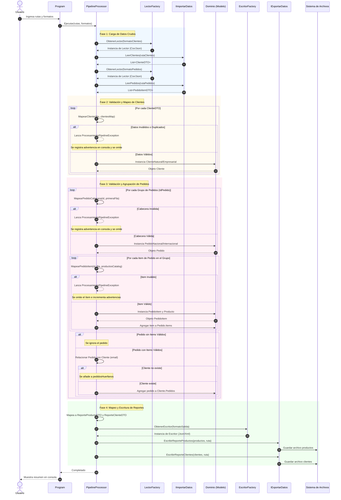

# Diagramas UML del Proyecto

Este documento contiene la representación visual de la arquitectura del proyecto utilizando la sintaxis de Mermaid. GitHub renderiza estos diagramas de forma nativa.

---

## 1. Diagrama de Clases Completo

```mermaid
classDiagram
    %% Capa de Dominio (Modelo)
    class Cliente {
        <<abstract>>
        -string _id
        -string _nombre
        -string _email
        -string _ciudad
        +ID string
        +Nombre string
        +Email string
        +Ciudad string
        +Pedidos List~Pedido~
        +ObtenerTotalAcumulado() decimal
        +ObtenerPedidoMasCostoso() Pedido?
        +EsFrecuente(int, decimal)* bool
    }
    class ClienteNatural {
        +EsFrecuente(int, decimal) bool
    }
    class ClienteEmpresarial {
        +EsFrecuente(int, decimal) bool
    }
    Cliente <|-- ClienteNatural
    Cliente <|-- ClienteEmpresarial

    class Pedido {
        <<abstract>>
        -string _idpedido
        -string _emailcliente
        +IDPedido string
        +FechaCompra DateTime
        +EmailCliente string
        +Items List~PedidoItem~
        +CalcularValorSinImpuestos() decimal
        +CalcularImpuestoAplicado()* decimal
        +CalcularValorTotalConImpuestos()* decimal
    }
    class PedidoNacional {
        +CalcularImpuestoAplicado() decimal
        +CalcularValorTotalConImpuestos() decimal
    }
    class PedidoInternacional {
        +CalcularImpuestoAplicado() decimal
        +CalcularValorTotalConImpuestos() decimal
    }
    Pedido <|-- PedidoNacional
    Pedido <|-- PedidoInternacional

    class PedidoItem {
        -int _cantidad
        -decimal _preciounitario
        +ProductoAsociado Producto
        +Cantidad int
        +PrecioUnitario decimal
        +CalcularSubtotalItem() decimal
    }
    class Producto {
        -decimal _preciounitario
        -string _idproducto
        -string _nombreproducto
        -string _categoria
        +PrecioUnitario decimal
        +IDProducto string
        +NombreProducto string
        +Categoria string
        +NumeroVentas int
    }

    Pedido "*" o-- "*" PedidoItem
    PedidoItem --> "1" Producto
    Cliente "1" o-- "*" Pedido

    %% Excepciones Personalizadas
    class ClienteInvalidoException
    class ProductoInvalidoException
    class PedidoInvalidoException
    class ProcesamientoPipelineException

    ClienteInvalidoException --|> ArgumentException
    ProductoInvalidoException --|> ArgumentException
    PedidoInvalidoException --|> ArgumentException
    ProcesamientoPipelineException --|> Exception

    %% Interfaces e I/O
    class IImportarDatos {
        <<interface>>
        +LeerClientes(string) List~ClienteDTO~
        +LeerPedidos(string) List~PedidoItemDTO~
    }
    class IExportarDatos {
        <<interface>>
        +EscribirReporteProductos(List~ReporteProductoDTO~, string)
        +EscribirReporteClientes(List~ReporteClienteDTO~, string)
    }

    class LectorCsv {
        +LeerClientes(string) List~ClienteDTO~
        +LeerPedidos(string) List~PedidoItemDTO~
    }
    class LectorJson {
        +LeerClientes(string) List~ClienteDTO~
        +LeerPedidos(string) List~PedidoItemDTO~
    }
    class EscritorJson {
        +EscribirReporteProductos(List~ReporteProductoDTO~, string)
        +EscribirReporteClientes(List~ReporteClienteDTO~, string)
    }
    class EscritorXml {
        +EscribirReporteProductos(List~ReporteProductoDTO~, string)
        +EscribirReporteClientes(List~ReporteClienteDTO~, string)
    }

    IImportarDatos <|.. LectorCsv
    IImportarDatos <|.. LectorJson
    IExportarDatos <|.. EscritorJson
    IExportarDatos <|.. EscritorXml

    %% Factories y Servicios
    class LectorFactory {
        +ObtenerLector(string) IImportarDatos$
    }
    class EscritorFactory {
        +ObtenerEscritor(string) IExportarDatos$
    }
    class PipelineProcessor {
        +Ejecutar(string, string, string, string, string, string, string) void
        -MapearCliente(ClienteDTO, Dictionary) Cliente
        -MapearPedidoCabecera(string, PedidoItemDTO) Pedido
        -MapearPedidoItem(string, PedidoItemDTO, Dictionary) PedidoItem
    }

    PipelineProcessor ..> LectorFactory : Usa
    PipelineProcessor ..> EscritorFactory : Usa
    PipelineProcessor ..> IImportarDatos : Usa
    PipelineProcessor ..> IExportarDatos : Usa

    %% Capa DTO
    class ClienteDTO
    class PedidoItemDTO
    class PedidoReporteDTO
    class ReporteClienteDTO
    class ReporteProductoDTO

    PipelineProcessor ..> ClienteDTO : Mapea de
    PipelineProcessor ..> PedidoItemDTO : Mapea de
    PipelineProcessor ..> ReporteClienteDTO : Exporta
    PipelineProcessor ..> ReporteProductoDTO : Exporta
```

---

## 2. Diagrama de Secuencia — Generación de Reportes

